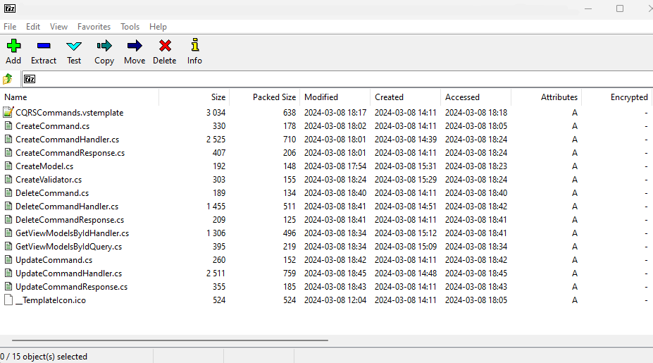

# Visual Studio 2022 Item Template to create a CQRS Folder Structure

This VS item template can be used to quickly create the file structure and core class files
for a CQRS pattern in a .NET 8 project. It has been designed for the MVC view model pattern but is easily adaptible.
Simply add a new item to use this template inside your features folder, 
enter in the domain entity name and the following structure is generated with default class files ready to implement.

## Features

The template:
1. Creates mutliple command files for Create, Delete and Update methods returning an updated model for Create & Update
2. Create a single query which fetches view model by Id - as a starting point.
3. Adds all the application file namespaces and usings to each C# class created based on the Entity name.
4. Assumes that AutoMapper is used to class map between Entities and Models;
5. Retrieves data from your implemented repository pattern;
6. Uses Mediatr Nuget package to handle the commands and queries.

## Using the item template
The class template files, along with the icon file and .vstemplate file, should be zipped, named and placed inside your VS 2022 item templates default folder.

!

It is often necessary to update your configuration from the VS dev command line so that it refreshes your VS instance with the new template as often the cache will need updating.

When you next add a new item from templates, you should now see the CQRS template - simply name the "file" with your entity name and it will create the folder structure 
and namespaces based on that name.

